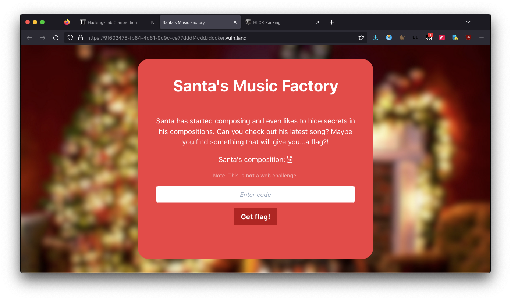

CSS: ../meta/avenir-white.css

[← Day 01](../day01/) / [↑ TOC](../README.md) / [→ Day 03](../day03/)

# Day 02 / HV22.02 Santa's song

## Challenge

* Author: kuyaya
* Tags:   `#fun`
* Level:  easy

Santa has always wanted to compose a song for his elves to cherish their hard
work. Additionally, he set up a vault with a secret access code only he knows!

The elves say that Santa has always liked to hide secret messages in his work
and they think that the vaults combination number may be hidden in the magnum
opus of his.

What are you waiting for? Go on, help the elves!

## Solution

There was this smol web service. It hosted a
[PDF file containing a "song"](song.pdf).

The song's note values gave a string of hex digits ...

`baefacedabaddeed`

If the hex-string was converted to decimal as a whole ...

`13470175147275968237`

... and entered as "code" into the web services's form field, then Santa told
you the flag.

--------------------------------------------------------------------------------

Flag: `HV22{13..s0me_numb3rs..37}`

[← Day 01](../day01/) / [↑ TOC](../README.md) / [→ Day 03](../day03/)
