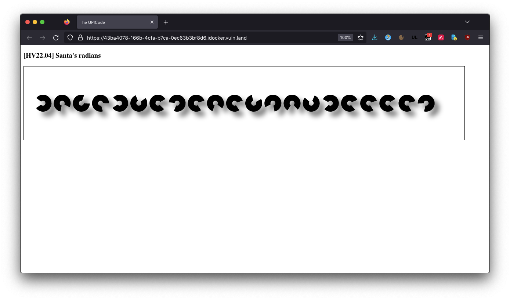

CSS: ../meta/avenir-white.css

[← Day 03](../day03/) / [↑ TOC](../README.md) / [→ Day 05](../day05/)


# Day 04 / HV22.04 Santas radians


## Challenge

* Author: dr. nick
* Tags:   `#fun`
* Level:  easy

Santa, who is a passionate mathematician, has created a small website to train
his animation coding skills. Although Santa lives in the north pole, where the
degrees are very low, the website's animation luckily did not freeze. It just
seems to move very slooowww. But how does this help...? The elves think there
might be a flag in the application...


## Solution

Again, this challenge featured a small web page the looked like this:



The open rings rotated in unison if you moved the mouse over their HTML-canvas.

An immediate suspicion was that the relative rotation of the rings somehow
encodes the flag characters. Regarding this suspicion, there was a piece of
Javascript code...

``` js
<script>
    const canvas = document.getElementById("canvasPiCode");
    const context = canvas.getContext("2d");
    let clientX = 0;

    canvas.addEventListener('mousemove', e => {
        clientX = e.clientX*7/1000;
    });

    let rot = [2.5132741228718345, 0.4886921905584123, -1.2566370614359172, 0, 2.548180707911721, -1.9547687622336491, -0.5235987755982988, 1.9547687622336491, -0.3141592653589793, 0.6283185307179586, -0.3141592653589793, -1.8151424220741028, 1.361356816555577, 0.8377580409572781, -2.443460952792061, 2.3387411976724013, -0.41887902047863906, -0.3141592653589793, -0.5235987755982988, -0.24434609527920614, 1.8151424220741028];
    let size = canvas.width / (rot.length+2);

    context.strokeStyle = "black";
    context.lineWidth = size*5/16;
    context.shadowOffsetX = size/4;
    context.shadowOffsetY = size/4;
    context.shadowColor = "gray";
    context.shadowBlur = size/4;

    let animCount = 0;

    function anim() {
        context.clearRect(0,0,canvas.width,canvas.height);
        for (let i = 0; i < rot.length; i++) {
            context.beginPath();
            context.arc((i + 1) * size, canvas.height / 2, size * 2 / 7, rot[i]+animCount+clientX, rot[i] + 5 +animCount+clientX);
            context.stroke();
        }
        animCount+=0.001;
        requestAnimationFrame(anim);
    }
    anim();

</script>
```

The rotation values `rot = […]` were extracted. As the title suggests these are
radians values and can be converted into degrees. A flag starts with the
characters `HV22{`. Converted ASCII-to-decimal these are `[72, 86, 50, 50, 123]`.

It took a while to see the next bit: `144 = 2 * 72` and all the other numbers
are also divisible by `2`, so they were all divided by `2`.

At this point the first character was fitting but the next ? It should be `86`
not `14`. The difference between the pair is `72` which is - well would you know
it - the first value again. So maybe all values should just be summed up ?

```
 Radians                Degrees     /2     Summed

 2.5132741228718345     144         72       72
 0.4886921905584123     28          14       86
-1.2566370614359172    -72         -36       50
 0                      0           0        50
 2.548180707911721      146         73      123
-1.9547687622336491    -112        -56       67
-0.5235987755982988    -30         -15       52
 1.9547687622336491     112         56      108
-0.3141592653589793    -18         -9        99
 0.6283185307179586     36          18      117
-0.3141592653589793    -18         -9       108
-1.8151424220741028    -104        -52       56
 1.361356816555577      78          39       95
 0.8377580409572781     48          24      119
-2.443460952792061     -140        -70       49
 2.3387411976724013     134         67      116
-0.41887902047863906   -24         -12      104
-0.3141592653589793    -18         -9        95
-0.5235987755982988    -30         -15       80
-0.24434609527920614   -14         -7        73
 1.8151424220741028     104         52      125
```

The summed values can be converted into ASCII and that's another flag.

Here's the code to do all that in python ...

``` python3
import math

rot = [
    2.5132741228718345, 
    0.4886921905584123, 
    -1.2566370614359172, 
    0, 
    2.548180707911721, 
    -1.9547687622336491, 
    -0.5235987755982988, 
    1.9547687622336491, 
    -0.3141592653589793, 
    0.6283185307179586, 
    -0.3141592653589793, 
    -1.8151424220741028, 
    1.361356816555577, 
    0.8377580409572781, 
    -2.443460952792061, 
    2.3387411976724013, 
    -0.41887902047863906, 
    -0.3141592653589793, 
    -0.5235987755982988, 
    -0.24434609527920614, 
    1.8151424220741028
]

value=0
flag=""
for num in rot:
    value += int(round(math.degrees(num),0)/2)
    flag += chr(value)

print(flag)
```

--------------------------------------------------------------------------------

Flag: `HV22{C4lcul8_w1th_PI`

[← Day 03](../day03/) / [↑ TOC](../README.md) / [→ Day 05](../day05/)
