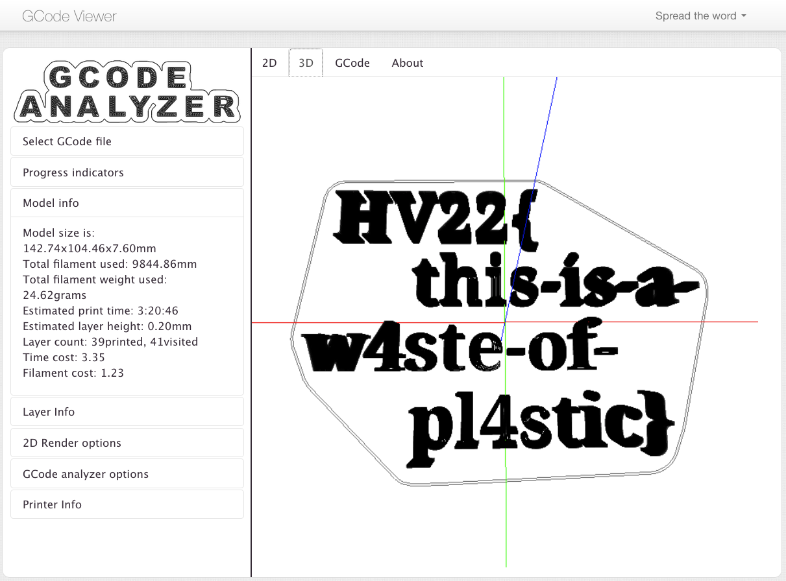

CSS: ../meta/avenir-white.css

[← Day 04](../day04/) / [↑ TOC](../README.md) / [→ Day 06](../day06/)

# Day 05 / HV22.05 Missing gift

## Challenge

* Author: wangibangi
* Tags:   `#forensic`, `#network_security`, `#fun`
* Level:  easy

Like every year the elves were busy all year long making the best toys in
Santas workshop. This year they tried some new fabrication technology. They had
fun using their new machine, but it turns out that the last gift is missing.

Unfortunately, Alabaster who was in charge of making this gift is not around,
because he had to go and fulfill his scout elf duty as an elf on the shelf.

But due to some very lucky circumstances the IT-guy elf was capturing the
network traffic during this exact same time.

**Goal**

Can you help Santa and the elves to fabricate this toy and find the secret
message?

**Resources**

A file download: [tcpdump.pcap](tcpdump.pcap)

## Solution

The file `tcpdump.pcap` was opened with wireshark. A search for the string
`hv22` yielded several matches regarding a file called `hv22.gcode`.

Wireshark was instructed to follow one of the matching tcp streams, that seemed
to contain a POST-Request for HTML-FORM-data containing the gcode data of a
file called `hv22.gcode`.

Wireshark was further used to display the stream's data in a continuous form.
The gcode data was selected, copied and pasted into a local file called
`hv22.gcode`.

This file was uploaded to an online service for viewing gcode file. The service
presented the following view:

The flag was read out manually.

--------------------------------------------------------------------------------

Flag: `HV22{this-is-a-w4ste-of-pl4stic}`

[← Day 04](../day04/) / [↑ TOC](../README.md) / [→ Day 06](../day06/)
