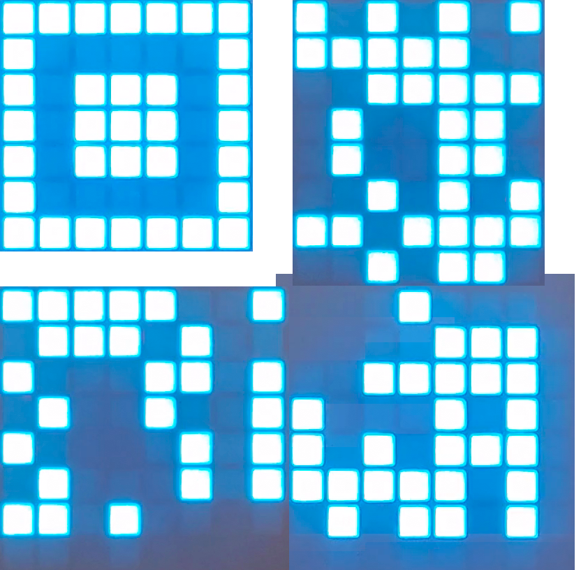
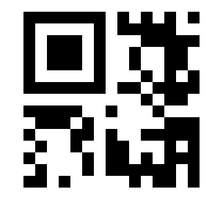

CSS: ../meta/avenir-white.css

[← Day 06](../day06/) / [↑ TOC](../README.md) / [→ Day 08](../day08/)

# Day 07 / HV22.07 St. Nicholas's animation

## Challenge

* Author: kuyaya
* Tags:   `#fun`
* Level:  easy

Santa has found a weird device called an "Oxocard Blockly", which seems to
display a sequence of images. He believes it has got something to do with a QR
code, but it doesn't seem complete...

You can't fly to the north pole, so Santa sent you a video of the device in
action.

The elves are having a karaoke and left with in a hurry while singing into
their micro. This means that they aren't there to help him, so now is your
chance to make a good impression and find the flag!

[St Nicholas's animation](santas_animation.mp4)

## Solution

The video is kind of a description on how to build a QR code. It starts with a
colorful intro animation that is not relevant to the solution.

After the into it shows 4 squares in sequence: top-left, top-right, bottom-left
and bottom-right. Then follow for parts of a QR-Code. Last the is again colorful
outro animation.

The 4 squares denote how the following QR code parts must be arraged. After
screenshoting and arranging the QR code parts in Gimp, the following image
resulted:

{width=50%}

After a bit of research it became clear that this is a so called
[Micro QR code][wenMicroQR]. And it also became clear, that my phone is not
capable of scanning such codes.

[wenMicroQR]: https://en.wikipedia.org/wiki/QR_code#micro

Instead a [web service specifically for micro QR codes][scanMicroQR] was used.
The scan only worked once the QR code was redrawn in a
[pixelart drawing software][pixelartQR].

[scanMicroQR]: https://www.dynamsoft.com/barcode-reader/barcode-types/micro-qr-code/
[pixelartQR]: https://www.pixilart.com/draw/qr-code-c70c8f58df

--------------------------------------------------------------------------------

Flag: `HV22{b0f}`

[← Day 06](../day06/) / [↑ TOC](../README.md) / [→ Day 08](../day08/)
