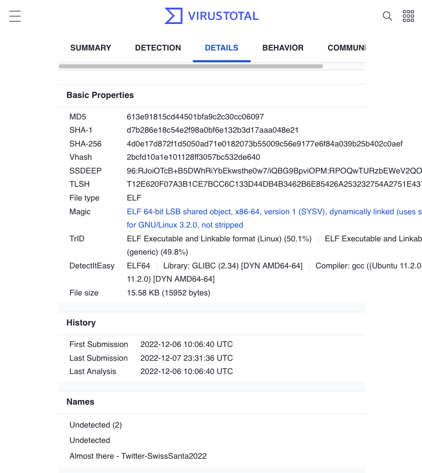

CSS: ../meta/avenir-white.css

[← Day 07](../day07/) / [↑ TOC](../README.md) / [→ Day 09](../day09/)


# Day 08 / HV22.08 Santa's Virus


## Challenge

* Author: yuva
* Tags:   `#OSInt`
* Level:  medium

A user by the name of HACKventSanta may be spreading viruses. But Santa would
never do that! The elves want you to find more information about this filthy
impersonator.


## Solution

Doing a web search for the user name `HACKventSanta` brought up ... nothing.
Not on Google, not on Duckduckgo, not on Yandex, Twitter, ... `:-/` But then
came Bing to the rescue `;-)` It's first match for `HACKventSanta` was a
[LinkedIn-Profile][linkedin] by the very user name (see LinkedIn-URL).

[linkedin]: https://ch.linkedin.com/in/hackventsanta


The profile contained the weblink
[`Portfolio` that pointed to a Github user][github]. That Github user had one
repository called `FILES`. Within that repository there were two files. A
README.md that just said `What are you looking for ?` and a ZIP-file
`files.zip`.

[github]: https://github.com/HackerSanta


In the ZIP-file there was just a very short `index.html` saying `No viruses
alive here 🤔 cant say anything about tags`... "Tags ? What tags ? Oh, maybe
git tags ?" and sure enough there was one release tagged ... `TAG`. `:^)`


The release consisted of three files ...

1. `Undetected`. More on that in a bit ...
2. _Source code (zip)_: `FILES-HV22.zip`, which just contained the repo files
   again.
3. _Source code (tar.gz)_: `FILES-HV22.tar.gz`, again with the same contents.

Identifying the `Undetected` file ...

``` sh
$ file Undetected
Undetected: ELF 64-bit LSB pie executable, x86-64, version 1 (SYSV), dynamically
linked, interpreter /lib64/ld-linux-x86-64.so.2,
BuildID[sha1]=ed87578ddf875b9911abf41472ed1b68ccc21cf4, for GNU/Linux 3.2.0, not
stripped
```

... revealed that it's a x86-Linux-executable. Soooo... I was brave/stupid and
just ran it ...

``` sh
$ chmod u+x Undetected
$ ./Undetected
I am innocent! 
I am not a hacker 
This is not a virus 
I can only give you key which you might need: 
 ThisIsTheKeyToReceiveTheGiftFromSanta 
But Go ahead and check my md5, I swear I am undetected!
```

The key `ThisIsTheKeyToReceiveTheGiftFromSanta` might come in handy later. The
executable also said to `check my md5` and that it would be `undetected`. "Off
to [VirusTotal][totalVirus] to upload this file!"

[totalVirus]: https://www.virustotal.com/gui/file/4d0e17d872f1d5050ad71e0182073b55009c56e9177e6f84a039b25b402c0aef/detection

The query result said `Undetected` by all `Security Vendors' Analysis`, no
suprise there. On the _Details_ page though under the section `Names` it said
`Almost there - Twitter-SwissSanta2022`



So another search on Twitter resulted in the
[user page for `@SwissSanta2022`][twitter] that featured 3 QR codes ...

[twitter]: https://twitter.com/SwissSanta2022
[googleDrive]: https://drive.google.com/file/d/11pKYrcwr7Hf1eSUq8twtN5aMK-oziPE4/view?usp=sharing


The last of QR codes contained an [URL to a Google-Drive][googleDrive] that in
turn contained a [password protected PDF][pdf] and sure enough, the password
from the executable was correct.

The PDF looked like this ...

[pdf]: SANTAAAAAAAA.pdf


... and contained a character string that's easily recognizable as being Base64
encoded. Decoding that string gave the flag ...

``` sh
$ base64 -D <(echo "SFYyMntIT0hPK1NBTlRBK0dJVkVTK0ZMQUdTK05PVCtWSVJVU30=")
HV22{HOHO+SANTA+GIVES+FLAGS+NOT+VIRUS}
```

--------------------------------------------------------------------------------

Flag: `HV22{HOHO+SANTA+GIVES+FLAGS+NOT+VIRUS}`

[← Day 07](../day07/) / [↑ TOC](../README.md) / [→ Day 09](../day09/)
