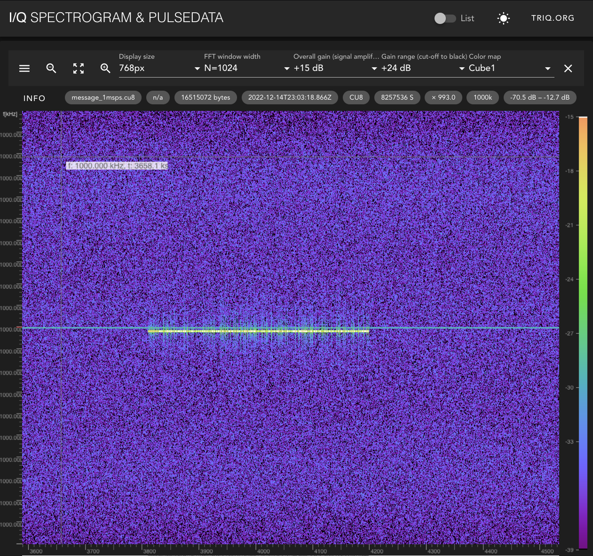
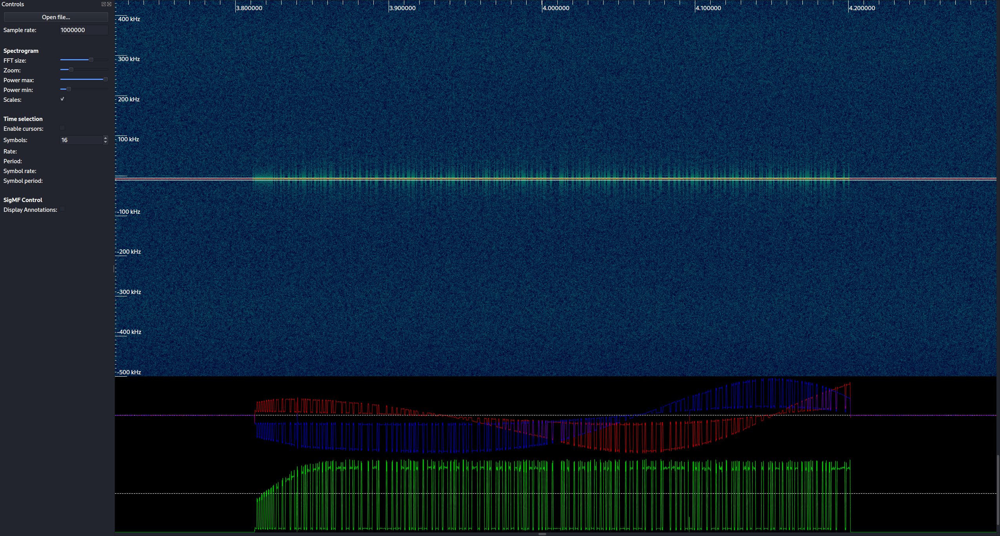
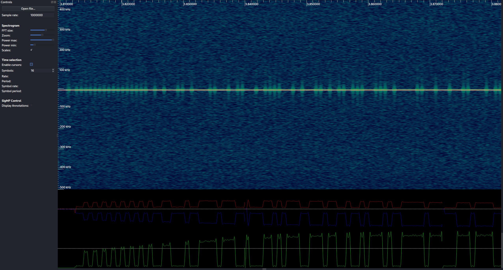
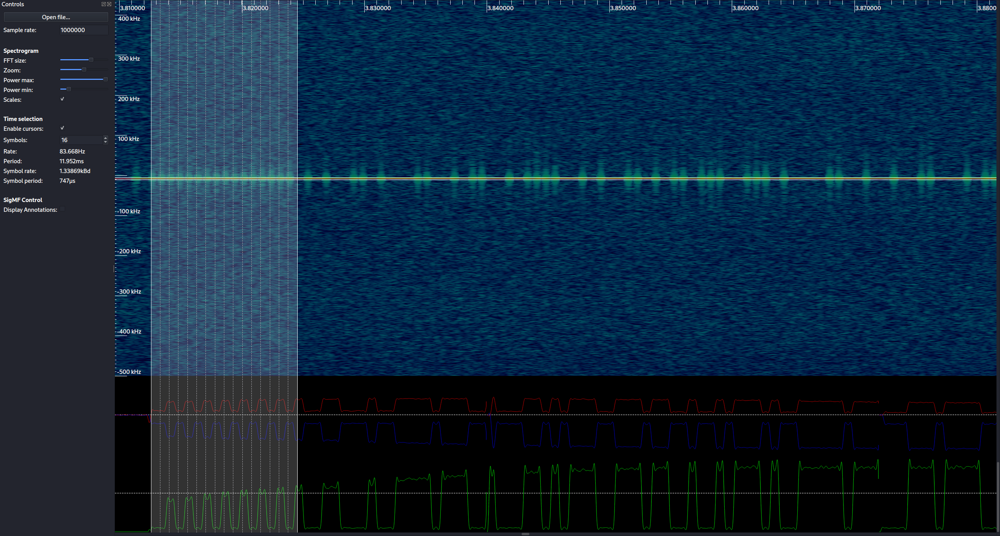
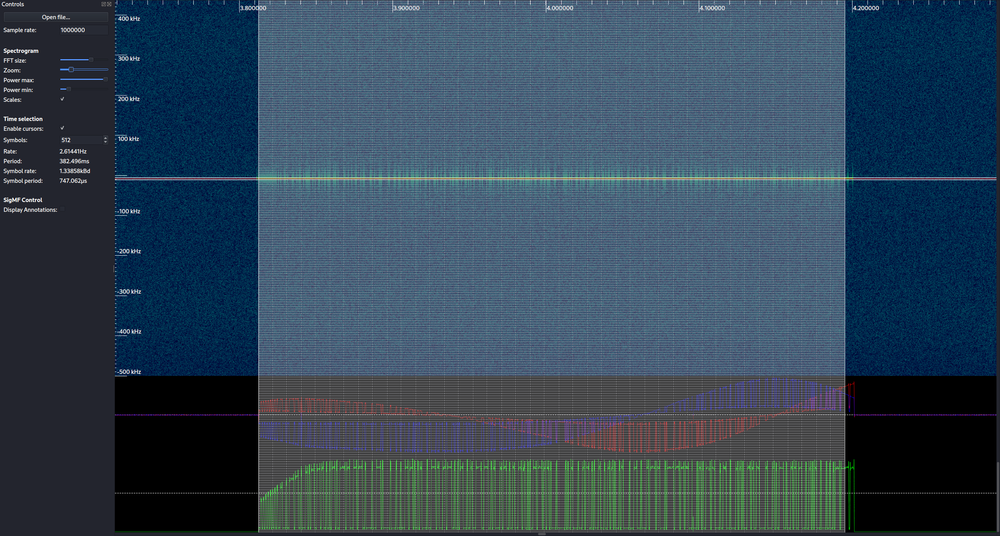

CSS: ../meta/avenir-white.css

[← Day 14](../day14/) / [↑ TOC](../README.md) / [→ Day 16](../day16/)


# Day 15 / HV22.15 Message from Space


## Challenge

* Author: cbrunsch
* Tags:   `#forensic` `#wireless`
* Level:  hard

One of Santa's elves is a bit of a drunkard and he is incredibly annoyed by the
banning of beer from soccer stadiums. He is therefore involved in the "**No
Return to ZIro beer**" community that pledges for unrestricted access to hop
brew during soccer games. The topic is sensitive and thus communication needs to
be top secret, so the community members use a special quantum military-grade
encryption radio system.

Santa's wish intel team is not only dedicated to analyzing terrestrial
hand-written wishes but aims to continuously picking up signals and wishes from
outer space too. By chance the team got notice of some secret radio
communication. They notice that the protocol starts with a preamble. However, the
intel team is keen to learn if the message is some sort of wish they should
follow-up. Can you lend a hand?

Download: [message_1msps.cu8](message_1msps.cu8)


## Solution

Searching the web slowly revealed that `.cu8` files are probably capture data
from an SDR (Software Defined Radio). First attempts to decode it with a
software called [_rtl\_433_][rtl433] failed. A
[web site dedicated to explain _rtl\_433_][rtl433explain] was helpful especially
because it included a link to a [online spectrogram viewer][onlineSpectrogram]
with which I was able to find and see the signal in question for the first
time...

[rtl433]: https://github.com/merbanan/rtl_433
[rtl433explain]: https://triq.org/rtl_433/
[onlineSpectrogram]: https://triq.org/pdv/



Further web research -
[especially a blog article about SDR software tools][compassSdrPost] (I believe
it's from the challenge author ?) - helped finding the right tool, a very handy
desktop application called [_Inspectrum_][inspectrum]. Using it it allowed to
examine the signal fully.

[compassSdrPost]: https://blog.compass-security.com/2016/09/software-defied-radio-sdr-and-decoding-on-off-keying-ook/
[inspectrum]: https://github.com/miek/inspectrum

Here is a screenshot from when the center frequency and power settings were
finally tuned in correctly. It shows a clean picture of the signal amplitude
(in green color at the bottom) containing the discrete data signal. Underneath
it is another screenshot zoomed in on the preamble, i.e. the start of the
signal. You can see how the sender circuit (or receiver; I'm not sure about
that) is ramping up its power ouput at the beginning of the transmission.





The preamble is a burst of `1`s at the beginning of a transmission. It
allows for clock recovery at the receiver. _Inspectrum_ has so called cursors
that can be overlaid with the signal. Afterwards signal values can be read out
at each vertical cursor position.

The cursors were carefully matched with the signal in the spectrogram, beginning
with 16 cursors at the preamble ...



... and working towards the end of the transmission by continously doubling the
number of cursors and each time adjusting the matching with the signal.



Finally 512 cursors were covering almost the whole transmission. The analog
signal values at each cursor could then be copied and saved as a CSV file:
[`raw_values.csv`](raw_values.csv)


### Processing the data

A python script was written to ...

1. normalize and convert the raw values into discrete highs (`1`) and lows
   (`0`),

2. apply the hinted at [NRZI][wenNrzi] encoding to the discrete values and thus
   converting them into a data bit stream,

3. convert the bit stream into a byte stream and a the same time translate the
   bytes into ASCII characters,

4. decoded the character string with Base64.

[wenNrzi]: https://en.wikipedia.org/wiki/Non-return-to-zero#NRZI

```python
import csv,base64

# Read raw values into list
rawValues = []
with open('raw_values.csv') as csvfile:
    csvreader = csv.reader(csvfile, delimiter=',', quotechar='"')
    for row in csvreader:
        rawValues = row    # There is only one row

# Convert raw values to discrete values
# Low ~= -0.9
# High >= -0.6
discreteValues = []
for rval in rawValues:
    if (float(rval) + 0.7) > 0.0:
        discreteValues.append(1)
    else:
        discreteValues.append(0)

# NZR decoding
bits = []
prevVal=discreteValues[0]
for i in range(1,len(discreteValues)):
    nextVal = discreteValues[i]

    if prevVal == nextVal:
        bits.append(0)
    else:
        bits.append(1)

    prevVal = nextVal

# Convert bitstream to ASCII
byte = 0
place = 7
strVal = ''
for bit in bits:
    byte += ((2**place) * bit)
    place -= 1

    if place < 0:
        strVal += chr(byte)
        byte=0
        place = 7

print(base64.b64decode(bytes(strVal,'UTF-8')))
```

The printed string contained the flag ...

```sh
$ python3 discrete_and_nrzi.py 
b'HV22{v-wish-v-g0t-b33r}'
```

--------------------------------------------------------------------------------

Flag: `HV22{v-wish-v-g0t-b33r}`

[← Day 14](../day14/) / [↑ TOC](../README.md) / [→ Day 16](../day16/)
