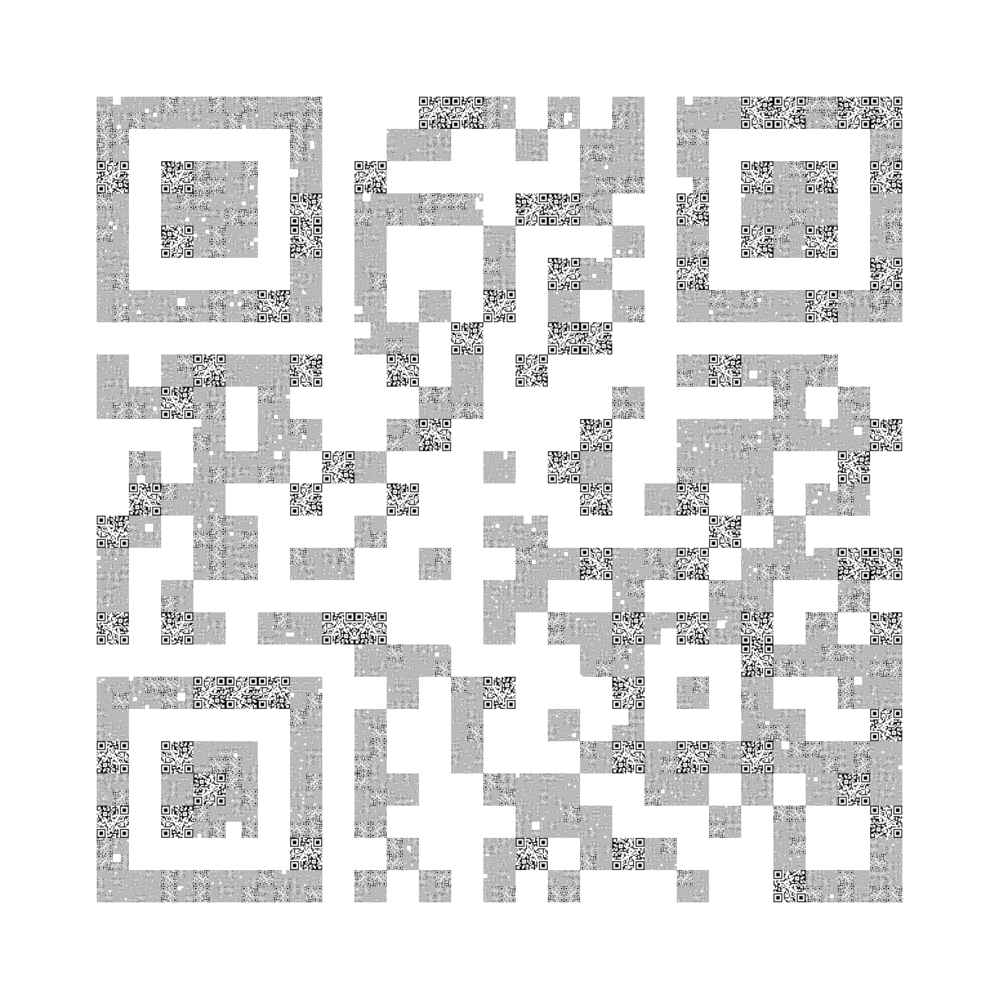
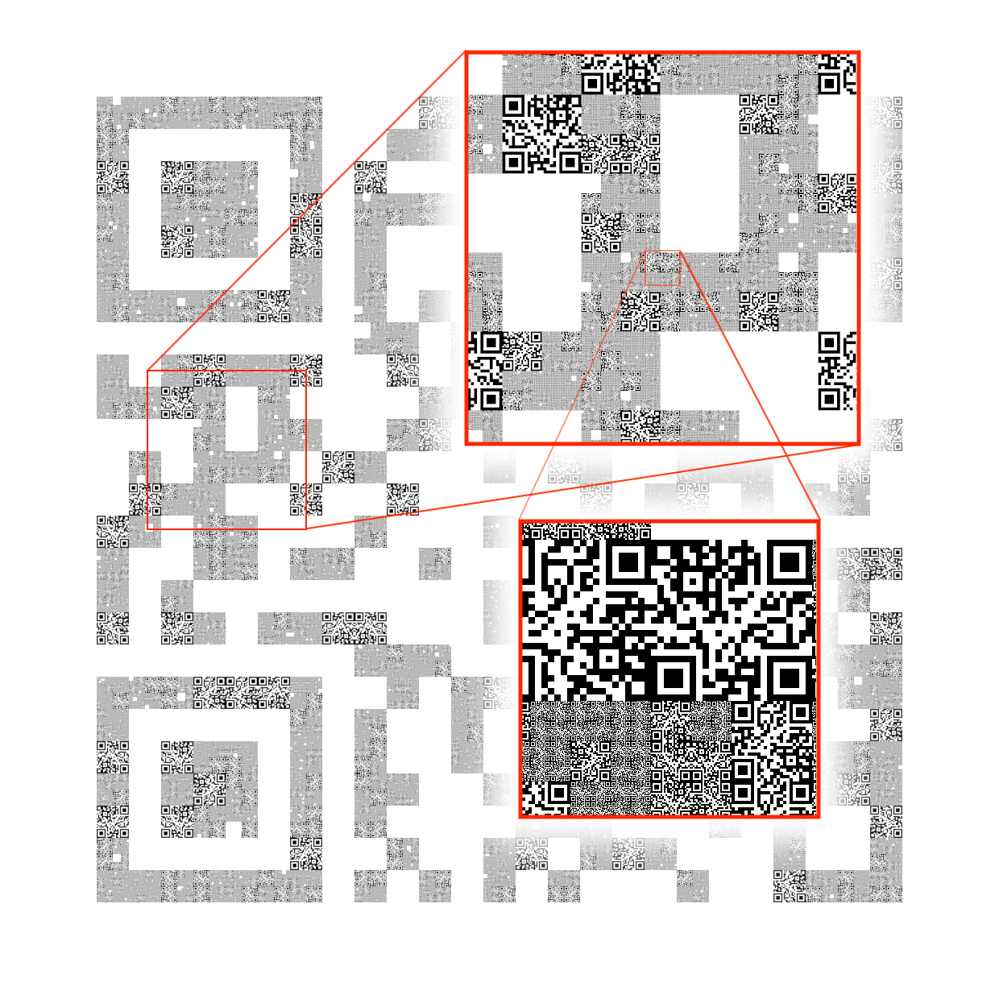

CSS: ../meta/avenir-white.css

[← Day 15](../day15/) / [↑ TOC](../README.md) / [→ Day 17](../day17/)


# Day 16 / HV22.16 Needle in a qrstack


## Challenge

* Author: dr_nick
* Tags:   `#fun`
* Level:  hard

Santa has lost his flag in a qrstack - it is really like finding a needle in a
haystack.

Can you help him find it?

Download: [haystack.png](haystack.png)


## Solution

In the file [haystack.png](haystack.png) was this truely crazy picture ... \
(This is a variant with drastically lowered resolution!)



The picture shows a HUGE QR code that reads `Sorry, no flag here!` when scanned.

The "pixels" of this QR code consist of ever smaller copies of the same QR code
arranged in what seems to be a fractal structure ...



So the goal is probably to find the one QR code that contains the flag.

The whole picture has a pixel count of a whopping `24800 × 24800`, i.e.
ca. `615` megapixels !

The thick white border was cropped away with Gimp so a side length of `20000`
pixels remained. See file [`haystackNoFrame.png`](haystackNoFrame.png)

First the picture was analyzed a bit. It turns out that the smallest QR code
has a side length of `25 px`. Each bigger variant grows in size as a power
series of `2` while the biggest variant has a side length of `800 px`. The
maximum amount of QR codes, that would fit into the `20000 x 20000 px` area was
also calculated for each QR code size.

```
Name     Size          Count
------------------------------------------
qr25     25 x 25       800 x 800 = 640'000
qr50     50 x 50                   160'000
qr100    100 x 100                  40'000
qr200    200 x 200                  10'000
qr400    400 x 400                   2'500
qr800    800 x 800                     625
------------------------------------------
                       Total       853'125
```

So a program that would split the picture file into squares of the size of the
QR codes and than at least attempt to scan each QR code, would have to fulfill
853'125 scan attempts. This seemed like ... a lot. I imagened that major 
optimization efforts were necessary.

_The initial plan was to write a C-lang program, that reads the pictures into
memory as a bit stream, then splits the bit stream into array elements
corresponding to the calculated QR code sizes and than tries to find unique
array elements only by rotateting them in 90° steps and additionally flipping
them once. To accommodate for the different sizes, the biggers sizes would have
been downsized by pixel picking. Only the remaining unique bit patterns would
afterwards have been scanned._

But none of that ever saw the day of light. Because tests with python and the
[_pyzbar_ QR code reader library][pyzbar] showed that it was easily fast enough.

[pyzbar]: https://pypi.org/project/pyzbar/

The following python code was written to solve the challenge.

```python
from pyzbar.pyzbar import decode
from PIL import Image

Image.MAX_IMAGE_PIXELS = None

im = Image.open(r"haystackNoFrame.png")
imWidth, imHeight = im.size

minimalScanSize = (50,50)

numOfQrSizes = 6
smallestQrSize = 25

uniqueQrStrings = []

numOfScans = 0
numOfScanSuccesses = 0

for scaleStep in range(numOfQrSizes):

    qrSize = smallestQrSize * 2**scaleStep
    steps = int(imWidth/qrSize)

    print("Searching for QR size: " + str(qrSize))

    numOfScans += steps**2
    for vStep in range(steps):
        for hStep in range(steps):
            print("Step: "+str(vStep*steps + hStep)+'/'+str(steps**2), end='\r')

            # Calculate cropping coordinates
            left = hStep * qrSize
            right = left + qrSize
            top = vStep * qrSize
            bottom = top + qrSize

            # Crop out the image part and try to QR-scan it
            tmpIm = im.crop((left,top,right,bottom))
            if qrSize < 50:
                tmpIm = tmpIm.resize(minimalScanSize, Image.Resampling(0))
            qrContent = decode(tmpIm)

            # Check whether the image part could be QR-scanned
            if len(qrContent) > 0:
                numOfScanSuccesses += 1
                qrString = qrContent[0].data.decode("utf-8")
    
                # Check whether QR code string is unique and if so store it
                isUnique = True
                for knownQrStr in uniqueQrStrings:
                    if qrString == knownQrStr:
                        isUnique = False
                        break
                if isUnique:
                    uniqueQrStrings.append(qrString)
                    print("Unique QR string found: "+qrString)

                    # Immediately print everything about QR strings starting
                    # with 'HV' and save a the image data do disk including
                    # coordinates
                    if qrString.find("HV") >= 0:
                        l = str(left)
                        t = str(top)
                        r = str(right)
                        b = str(bottom)
                        print('left:   ' + l)
                        print('top:    ' + t)
                        print('right:  ' + r)
                        print('bottom: ' + b)
                        tmpIm.save(qrString+'_'+l+'_'+t+'_'+r+'_'+b+'.png')

print("\n")
print("Total number of QR scans:            "+str(numOfScans))
print("Total number of successful QR scans: "+str(numOfScanSuccesses))
```

It splits the original picture into a number of tiles corresponding to the QR
code sizes and tries to scan each tile. It is suprisingly fast. Processing all
853'125 tiles only took around `4 min` on a Intel i5 Laptop.

One edge case had to be dealt with: apparently the _pyzbar_ library cannot read
QR codes that are only `25 x 25 px`. Those were therefore scaled to
`50 x 50 px`.

The python script searches and outputs any unique QR code string. For strings
the begin with `HV` it additionally prints position pixel coordinates and stores
a copy of the QR code itself as a picture file.

```sh
$ time python3 findflagQr.py 
Searching for QR size: 25
Unique QR string found: Sorry, no flag here!
Searching for QR size: 50
Unique QR string found: HV22{1'm_y0ur_need13.}
left:   16000
top:    10150
right:  16050
bottom: 10200
Searching for QR size: 100
Searching for QR size: 200
Searching for QR size: 400
Searching for QR size: 800
Step: 624/625

Total number of QR scans:            853125
Total number of successful QR scans: 87916

real	3m52.199s
user	3m48.081s
sys	0m3.483s
```

Here is the QR code containing the flag that the script found ...


And here is its position within the whole picture. Yes, it's just that tiny
blip ...


--------------------------------------------------------------------------------

Flag: `HV22{1'm_y0ur_need13.}`

[← Day 15](../day15/) / [↑ TOC](../README.md) / [→ Day 17](../day17/)
