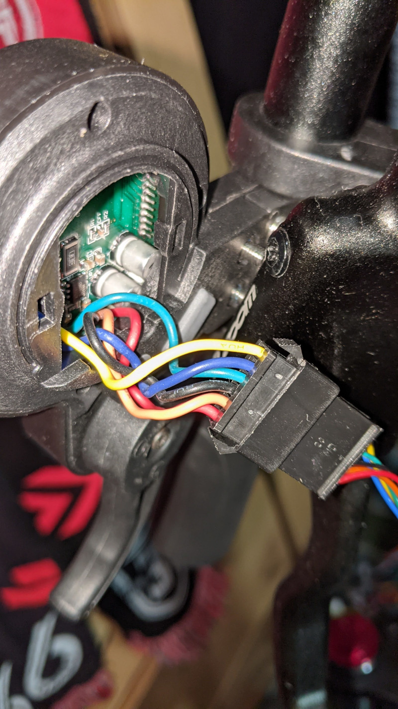
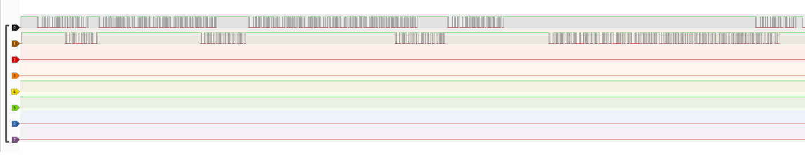
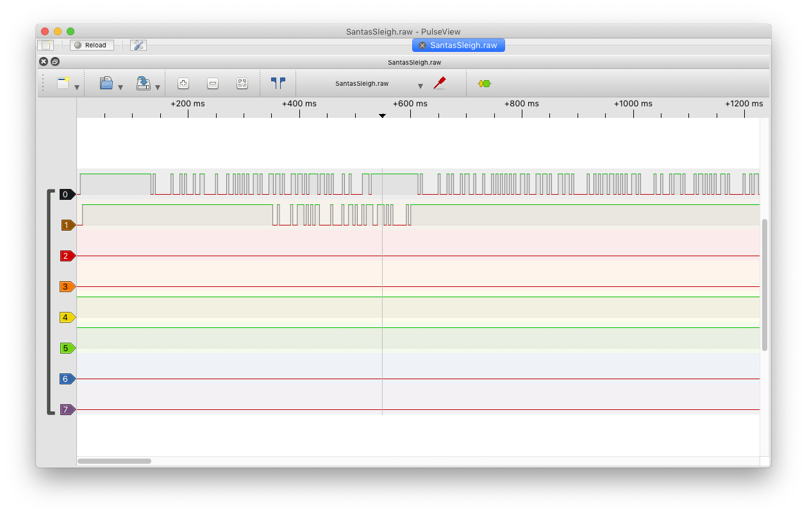
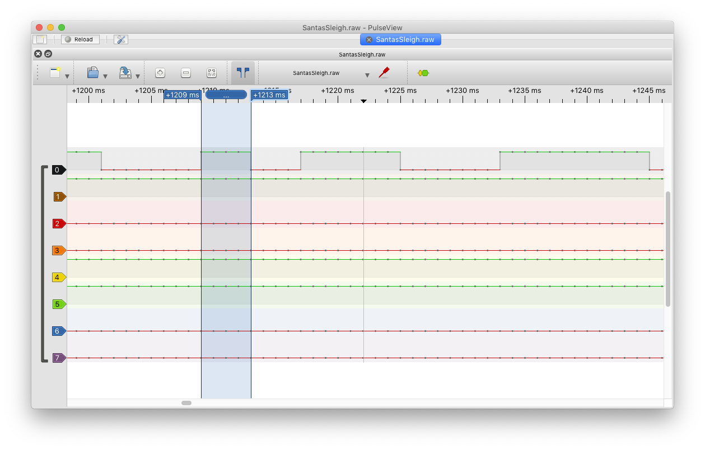
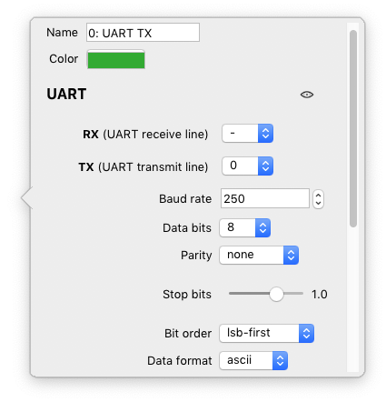
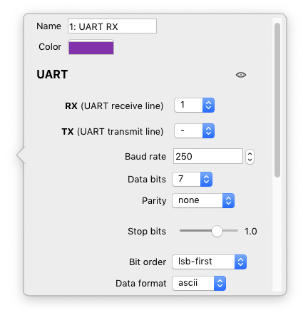
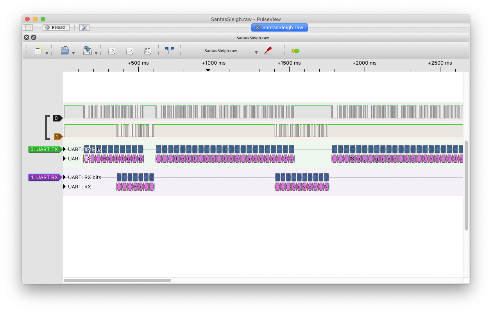

CSS: ../meta/avenir-white.css

[← Day 16](../day16/) / [↑ TOC](../README.md) / [→ Day 18](../day18/)


# Day 17 / HV22.17 Santa's Sleigh


## Challenge

* Author: dr_nick
* Tags:   `#reverse-engineering` `#forensic`
* Level:  hard

As everyone seems to modernize, Santa has bought a new E-Sleigh. Unfortunately,
its speed is limited. Without the sleight's full capabilities, Santa can't
manage to visit all kids... so he asked Rudolf to hack the sleigh for him.

I wonder if it worked.

Unfortunately, Rudolph is already on holiday. He seems to be in a strop because
no one needs him to pull the sledge now. We only got this raw data file he sent
us.

Download: [SantasSleigh.raw](SantaSleigh.raw)

--------------------------------------------------------------------------------

### Hints

*  Rudolph is heavy on duty during his holiday trip, but he managed to send at
   least a photo of his first step.

   

*  Rudolf finally wants some peace and quiet on vacation. But send us one last
   message together with a picture:

   "I thought they speak 8 or 7 N1" \
   


## Solution

At first (before the hints) I was completely lost. The file `SantasSleight.raw`
is filled with `0`, `1`, `2` and `3`. I expected it to be an encoded firmware
binary or at least a part of a binary. But the data just looked so unfamiliar,
almost like picture data. The `.raw` ending was vague but could also hint at
raw picture format.

It said in the byline something about E-Scooter. So naturally I mostly searched
for E-Scooter hacking content. There are multiple mature hacking apps to alter
the properties of E-Scooter firmwares. But these apps generally just send a new
firmware to a scooter via Bluetooth BLE. For a while I was focused on
researching if this data blob could somehow be a recording from a BLE sniffer
(which wasn't that far away from the truth).

I even started to write an experimental decoder for the data since it's
structure seemed almost tangible. But the results from that obviously made no
sense and the attempt was ultimately thrown out.

After 3h it was enough. "I'll let future me deal with this."


#### After the hints

(The first hint was misleading in my opinion. So I'll just sideline that.)

The second hint was very helpful: That's a partial screenshot of [_sigrok_'s
_pulsview_][sigrok]. It became evident that the file `SantasSleigh.raw` is a
sample capture from a logic analyzer done with _sigrok_. So I installed
_pulseview_ and imported the file ...

[sigrok]: https://sigrok.org/wiki/PulseView

**Note**: It's important to select _any_ sample rate
other than `0` while importing. Otherwise none of the decoding functions
work. I selected `1000 Hz` as it simplifies further baud rate calculations.



The text "8 or 7N1" from the second hint refers to the [UART][wenUart] 
communication protocol. So a serial decoder was setup within _pulseview_. For
the serial decoder to work, the baud rate must be setup correctly. This can be
done by looking through the signals for a single symbol and then counting it's
samples ...

[wenUart]: https://en.wikipedia.org/wiki/Universal_asynchronous_receiver-transmitter



The blue markers span a single symbol. It contains 4 samples. Baud rate
calculations:

```
Sample rate: SR = 1000 Hz (set arbitrarily while importing)

1 sample  has  a duration of:
1 SD  = 1 / SR = 1/1000 = 0.001 s

A symbol has the duration of 4 samples:
1 SyD = SD * 4          = 0.004 s

Baud rate is how many symbols per second: 1/0.004 = 250 baud
```



RX and TX were setup with separate decoders in order to set TX to `8N1` and RX
to `7N1`. Afterwards the message exchange could be read in plain text...



It said ...

```
TX: Hello!
RX: Hi.
TX: Tell me the secret!
RX: Never.
TX: So, give me the flag instead.
RX: No way.
TX: Please!
RX: Ok, here it is: HV22{H4ck1ng_S4nta's_3-Sleigh}
TX: Thx!
```

--------------------------------------------------------------------------------

Flag: `HV22{H4ck1ng_S4nta's_3-Sleigh}`

[← Day 16](../day16/) / [↑ TOC](../README.md) / [→ Day 18](../day18/)
