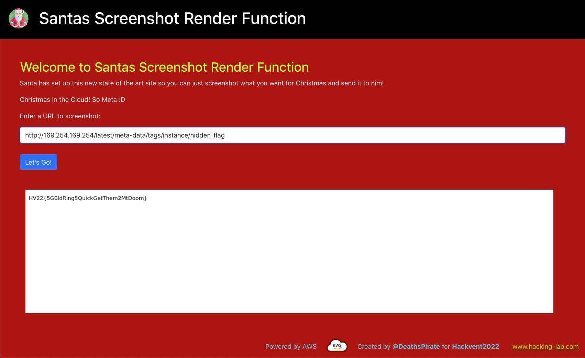

CSS: ../meta/avenir-white.css

[← Hidden 01](../hid01/) / [↑ TOC](../README.md) / [→ Hidden 03](../hid03/)

# Hidden 02 / HV22.H2 The Elves's Secret


## Challenge

* Tags:   `#fun`
* Level:  medium

Uhm...hello? What are you doing here? I thought you were tasked with finding a
hidden flag in one of the medium challenges??

There is no 24h bonus on the hidden challenges!


## Solution

On the challenge of [day 11](../day11/), there was hint in the _AWS secret_ where
the second half of that day's flag was to be found. It said:

```
Oh I forgot to mention I overheard some of the elves talking about making tags
available ... maybe they mean gift tags?! Who knows ... maybe you can make
something out of that ... or not :D
```

It is possible to attach tags to AWS resources for various purposes. So after
finding that out, I tried to list all tags with the _aws cli_. But that didn't
work because using any tag-related operations was restricted.

After being bummed out for a moment, I realized, that the tags were probably
available via the meta endpoint. By guessing the first directory as being `tags`
it was then easy to navigate to the relevant file with the
screenshot-meta-backdoor ...



--------------------------------------------------------------------------------

Flag: `HV22{5G0ldRing5QuickGetThem2MtDoom}`

[← Hidden 01](../hid01/) / [↑ TOC](../README.md) / [→ Hidden 03](../hid03/)
